 # Load Balancer Solution With Apache

First Step: Configure Apache As A Load Balancer
1. Create an Ubuntu Server 20.04 EC2 instance and name it Project-8-apache-lb, 

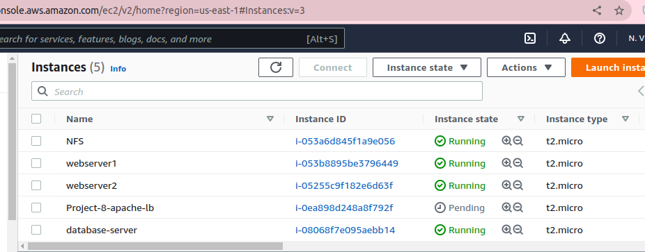

2. Open TCP port 80 on Project-8-apache-lb by creating an Inbound Rule in 
Security Group.i.e http - 0.0.0.0.

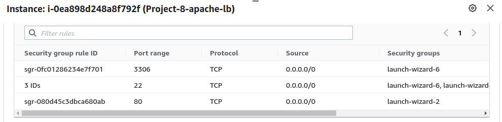

3. Install Apache Load Balancer on Project-8-apache-lb server and configure 
it to point traffic coming to LB to both Web Servers:

- Install apache2
     - Run `sudo apt update -y`
     - Run `sudo apt install apache2 -y`
     - Run `sudo apt-get install libxml2-dev -y`
- Enable following modules and restart Apache2 service:
     - Run `sudo a2enmod rewrite`
     - Run `sudo a2enmod proxy`
     - Run `sudo a2enmod proxy_balancer`
     - Run `sudo a2enmod proxy_http`
     - Run `sudo a2enmod headers`
     - Run `sudo a2enmod lbmethod_bytraffic`
     - Run `sudo systemctl restart apache2`

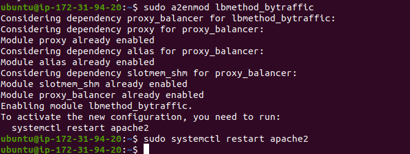  

- Make sure apache2 is up and running.
     - Run `sudo systemctl status apache2`

        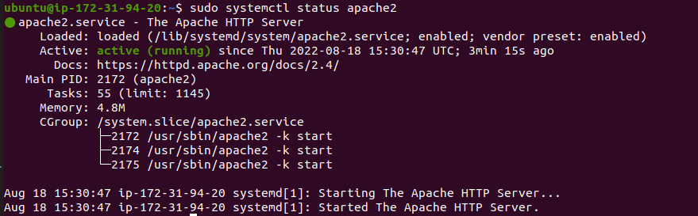  

- Configure load balancing (modify the default config file of apache server to map the ip of webservers to the load balancers so that it can distribute services to the webservers).
     - Run `sudo vi /etc/apache2/sites-available/000-default.conf`

     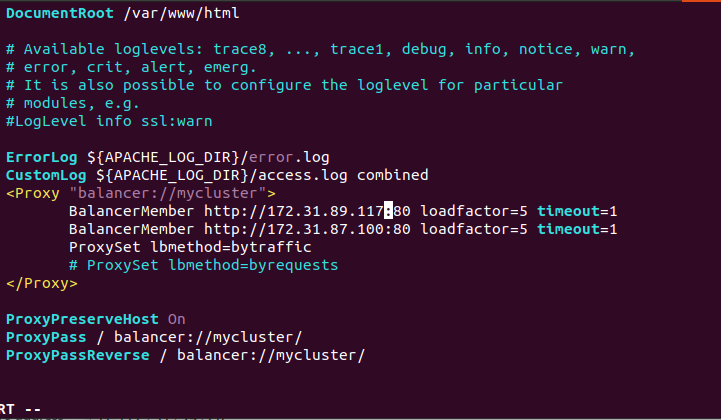

- Restart apache server
  Run `sudo systemctl restart apache2`

   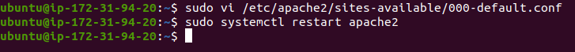

4. Verify that our configuration works – try to access your LB’s public IP address or 
Public DNS name from your browser:

   - Use `http://<Load-Balancer-Public-IP-Address-or-Public-DNS-Name>/index.php`

   

- Make sure that each Web Server has its own log directory by unmounting /var/log/httpd/ from both Web Servers ealier mounted. 
  - Run `sudo umount -f /var/log/httpd/`

     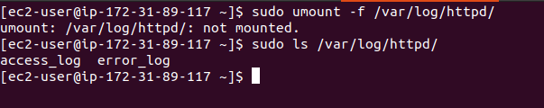
     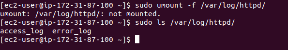

Check the access log of both webservers.
- Open two ssh consoles for both Web Servers and run following command:
        
  - Run `sudo tail -f /var/log/httpd/access_log`

  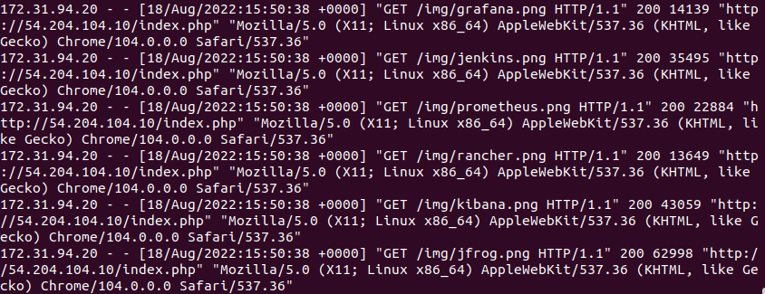

  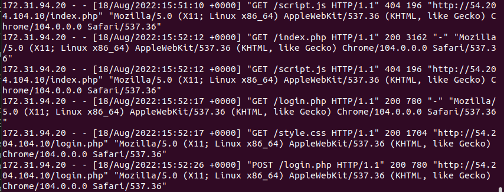

- Refresh the LB browser page several times and make sure that both webservers receive HTTP GET requests from your LB – new records must appear in each server’s log file. The number of requests to each server will be distributed evenly since the value of the loadfactor is the same for both servers.

  - Use `http://<Load-Balancer-Public-IP-Address-or-Public-DNS-Name>/index.php`

    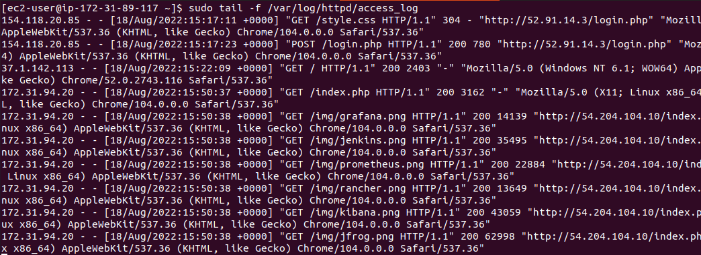
    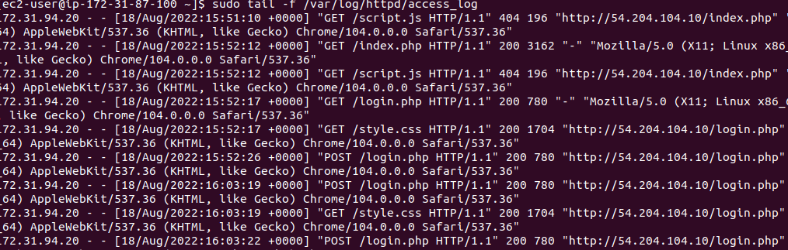

5. Optional step - Configure Local DNS Names Resolution for the 2 webservers on the loadbalancer server. 

- By editing the /etc/hosts file on LB server, IP address to domain name mapping be configured. Open the file on your LB server and add
  - Run `sudo vi /etc/hosts` then add as follows and save the file:
  -  `(WebServer1-Private-IP-Address) Web1, (WebServer2-Private-IP-Address) Web2`.

  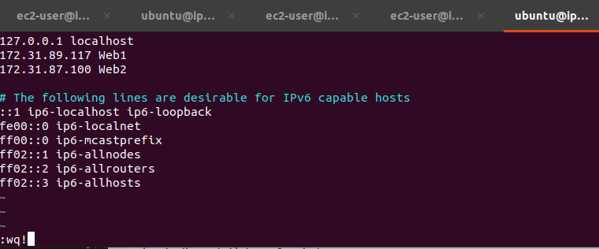

- Update the LB config file with those names instead of IP addresses:
  - Run `sudo vi /etc/apache2/sites-available/000-default.conf`
  - then add as follows and save:
  - `BalancerMember http://Web1:80 loadfactor=5 timeout=1`
  - `BalancerMember http://Web2:80 loadfactor=5 timeout=1`

  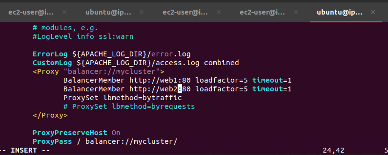

As an internal configuration it only applies to the loadbalancer server not accessible on the intenet. Try to curl the Web Servers from LB locally.
- `curl http://Web1 or curl http://Web2` 

  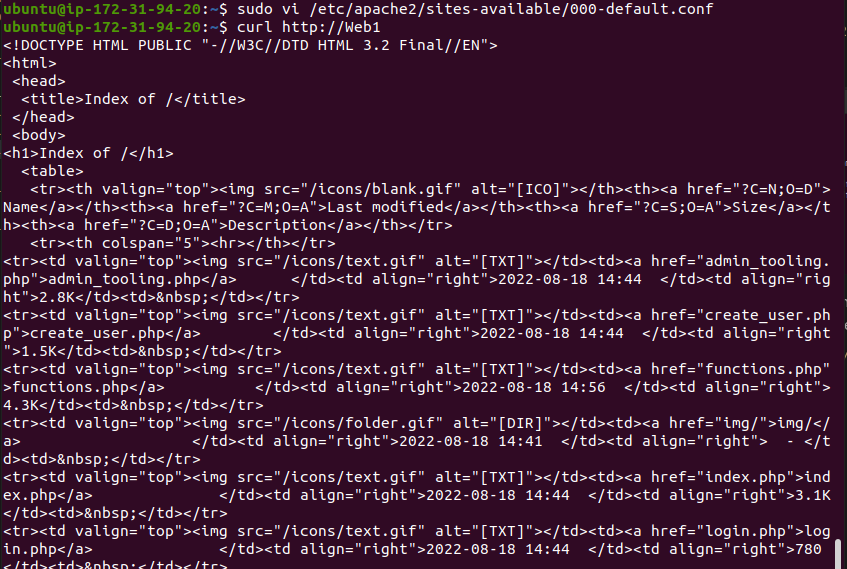

